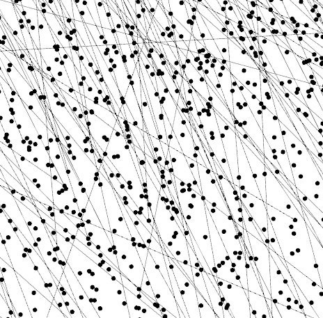

# CPU-Tracer

A header-only C++ library for loading, reconstructing, and analyzing CPU execution traces.

## Overview

Lightweight, header-only C++ library for working with raw per-block execution traces emitted using a dynamic binary instrumentation.
It provides reusable tools that turn a serialized trace (basic blocks, edges, interrupts, VCPU state changes, MMIO accesses) into structured
data and a Control Flow Graph (CFG) using Boost Graph Library (BGL) to make integration into existing projects easier.

Includes:
* **Block Format** – Self-describing, tagged binary format for basic blocks, instructions, edges, interrupts, VCPU states, and MMIO/Special Memory accesses, with LZ4-compressed edges.
* **Loading & Analysis** – Stream a trace file into memory, sort and index blocks by global ID and real PC, and reconstruct successor/predecessor edges from raw execution data, interrupts, and self-modifying/retranslated blocks.
* **Graph Construction** – Build a deterministic ```boost::adjacency_list``` CFG from analyzed blocks and edges.

### Reconstructed Control Flow Graph (CFG) Example
The library turns thousands of raw execution blocks and branch edges into an graph structure:


**Part of a generated trace from boot to normal usage of Windows Vista, Contains over 4 million nodes and 3 million edges**

## Importing

Importing all library functions just requires
```
#include "cpu_tracer/common.hpp"
```

## Libraries

Some libraries are used to reduce ABI reliant issues and increase speed

* [BoostPP flat vector](https://github.com/Pidova/BoostPP/blob/main/vector.hpp) **e.g. boost::fixed_vector<std::uint8_t, MAX_LEN, std::uint8_t>** - 
MAX Len is maximum size the data is expected to have, stored as an contigous array with the 3rd template argument describing internal size tracker type.

- [Boost smart pointers, vectors, maps](https://www.boost.org/)

## Documentation and Examples

All documentation and examples for each can be found:

- [Block Format](docs/blocks.md) – The on-disk layout of blocks, instructions, trace records, and terminology
- [Loading & Analysis](docs/loading_and_analysis.md) – Stream a trace file into memory and reconstruct its edges
- [Graph Construction](docs/graph.md) – Build a Boost Graph Library CFG from analyzed trace data
